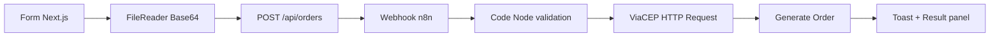

# STLFLIX Pedido Bridge

Frontend Next.js para o desafio de Engenharia de Software: captura um pedido, converte imagem para Base64 no navegador, envia para um webhook n8n e renderiza o status consolidado ao usuário.

## Stack

- Next.js `16.2.7`
- React `19.2.7`
- TypeScript `6.0.3`
- Vitest `4.1.8`
- Playwright `1.60.0`
- Storybook `10.4.2`
- axe Playwright `4.11.3`
- Lighthouse `13.3.0`

## Rodando localmente

```bash
pnpm install
cp .env.example .env.local
pnpm dev
```

Configure `N8N_WEBHOOK_URL` no `.env.local` com a URL pública do webhook POST criado no n8n.

## Arquitetura

O client envia para `/api/orders`, e a rota server-side lê `N8N_WEBHOOK_URL`. Isso evita expor o webhook real no bundle público e ainda preserva o contrato de status HTTP para a tela.



## Entregáveis n8n

- Workflow principal: `n8n/workflows/stlflix-pedido-bridge.workflow.json`
- Workflow de captura de erro de runtime: `n8n/workflows/stlflix-pedido-bridge-error-catch.workflow.json`

No n8n, importe o workflow principal, publique o webhook e copie a Production URL para `N8N_WEBHOOK_URL`.

## Organização FDD

```text
src/features/order-capture
  components/  # UI e estados visuais
  data/        # opções de produto
  domain/      # schemas, tipos e normalizadores
  hooks/       # estado assíncrono do fluxo
  services/    # Base64 e chamada da ponte
```

## Gates de qualidade

### Automatizados

- `pnpm lint` — ESLint com as regras Next.js Core Web Vitals.
- `pnpm test` — Testes unitários e de componente com Vitest.
- `pnpm test:e2e` — Fluxos desktop e mobile com Playwright.
- `pnpm test:a11y` — Varredura WCAG A/AA com axe + Playwright, incluindo `color-contrast`.
- `pnpm build` — Build de produção Next.js.
- `pnpm build-storybook` — Build isolado de documentação de UI.
- `pnpm perf:lighthouse` — Relatório Lighthouse local em JSON para performance, acessibilidade e boas práticas.

### Manuais

- O formulário não pode ser enviado enquanto estiver inválido.
- O botão de envio fica desabilitado enquanto a requisição está em andamento.
- Sucesso exibe número do pedido, cidade, estado, CEP e status HTTP.
- Erro exibe exatamente a mensagem retornada pelo n8n.

### Web Vitals

O app inclui `src/app/_components/web-vitals-reporter.tsx`, que envia CLS, FCP, INP, LCP e TTFB para `/api/web-vitals`. Em desenvolvimento, as métricas também são exibidas no console.
